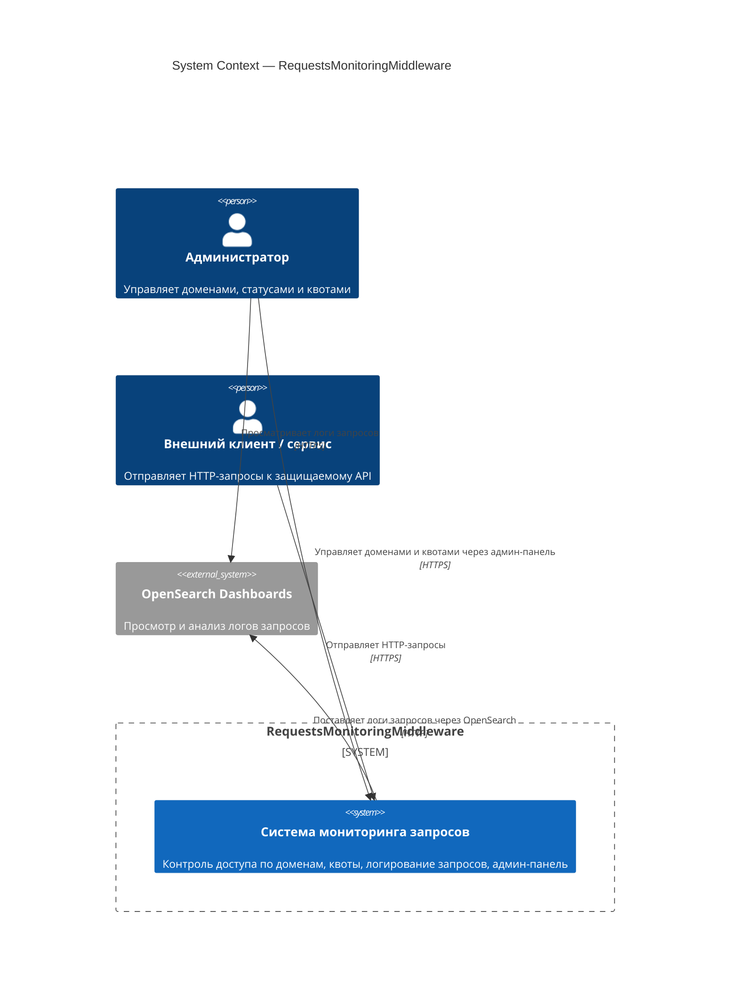

# C4 · Уровень 1 — System Context

Диаграмма контекста показывает систему `RequestsMonitoringMiddleware` целиком и
её взаимодействие с внешними пользователями и системами.

## Действующие лица и системы

- **Администратор** — пользователь, отвечающий за конфигурацию: добавляет
  домены, выставляет статусы (`Whitelisted`, `Greylisted`, `Unknown`), создаёт и
  меняет квоты.
- **Внешний клиент / сервис** — любой потребитель защищаемого API. Запросы от
  него проходят через `RequestMonitoringMiddleware` и могут быть пропущены,
  заблокированы или ограничены по квоте.
- **OpenSearch Dashboards** — внешняя система визуализации, в которую
  администратор заходит для анализа логов, индексируемых системой.

## Основные сценарии

1. Клиент шлёт HTTP-запрос → система проверяет домен и квоту → запрос
   пропускается, либо возвращается `401 / 402 / 429`.
2. Каждый запрос асинхронно логируется в OpenSearch.
3. Администратор через админ-панель меняет статус домена / создаёт квоту;
   изменения немедленно отражаются в кэше и видны middleware.
