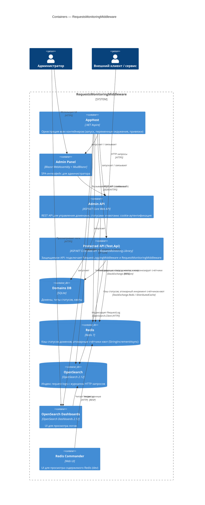

# C4 · Уровень 2 — Containers

Диаграмма контейнеров детализирует систему `RequestsMonitoringMiddleware`
до уровня развёртываемых приложений и хранилищ. Оркестрация выполняется через
.NET Aspire (`RequestMonitoring.AppHost`).

## Контейнеры

| Контейнер | Технологии | Назначение |
|---|---|---|
| **AppHost** | .NET Aspire | Декларативное описание топологии (`AppHost.cs`): поднимает Redis, OpenSearch, OpenSearch Dashboards и три приложения с нужными переменными окружения. |
| **Admin Panel** | Blazor WebAssembly, MudBlazor | SPA для администратора. Авторизуется в Admin API через cookie (`CookieHandler`, `CookieAuthStateProvider`). |
| **Admin API** | ASP.NET Core Web API, EF Core, Mapster, Scalar | REST API для CRUD над доменами, статусами и квотами; логин/логаут через `AuthController` (cookie-аутентификация). |
| **Protected API (Test.Api)** | ASP.NET Core, `RequestMonitoring.Library` | Демонстрационное защищаемое API. В пайплайне подключены `RequestLoggingMiddleware` и `RequestMonitoringMiddleware`. |
| **Domains DB** | SQLite | Таблицы `domain`, `domain_status_type`, `quota`. |
| **Redis** | Redis | (1) Кэш `Domain_{host}` со статусом домена; (2) ключи счётчиков квот, инкрементируемые атомарно. |
| **OpenSearch** | OpenSearch 2.12 | Индекс `request-logs` с документами `RequestLog`. |
| **OpenSearch Dashboards** | OpenSearch Dashboards | UI для логов. |
| **Redis Commander** | Web UI | Dev-инструмент для просмотра Redis. |

## Ключевые потоки

- **Запрос клиента** идёт в `Test.Api` → проходит `RequestLoggingMiddleware`
  (стартует таймер, регистрирует логирование) → `RequestMonitoringMiddleware`
  (проверка домена и квоты) → контроллер. После завершения запроса лог
  асинхронно отправляется в OpenSearch.
- **Изменения администратора** через Admin Panel → Admin API → SQLite, после
  чего Admin API вызывает инвалидацию ключа в Redis (`IDomainCacheService`,
  `IQuotaCacheService`), чтобы `Test.Api` сразу увидел новое состояние.
