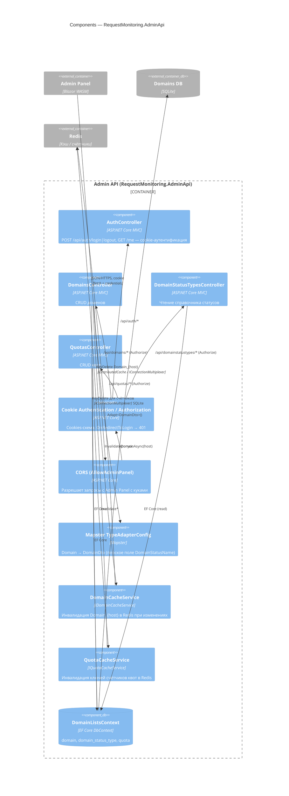

# C4 · Уровень 3 — Components: Admin API

Диаграмма раскрывает внутреннее устройство контейнера **Admin API**
(`RequestMonitoring.AdminApi`).

## Пояснения

- **Аутентификация**: схема `Cookies` с `HttpOnly`, `SameSite=Strict`,
  `Secure` в продакшене. Контроллеры (`Domains`, `DomainStatusTypes`,
  `Quotas`) защищены атрибутом `[Authorize]`; `AuthController` — `[AllowAnonymous]`
  для `/login`.
- **CORS**: политика `AllowAdminPanel` разрешает запросы только с фронтенда
  Admin Panel, с поддержкой кук (`AllowCredentials`).
- **DTO-маппинг**: `Mapster` сконфигурирован в `Program.cs` так, что у
  `DomainDto` есть плоское поле `DomainStatusName` (по соглашению ABP-style:
  `*Dto` для чтения, `*CreateUpdateDto` для записи).
- **Согласованность кэша и БД**: после любого изменения домена / квоты
  контроллер вызывает соответствующий `*CacheService`, который удаляет ключи
  в Redis, чтобы `Test.Api` сразу подхватил новое состояние.
- **Документация API**: в Development подключаются OpenAPI и Scalar
  (`MapOpenApi`, `MapScalarApiReference`).
