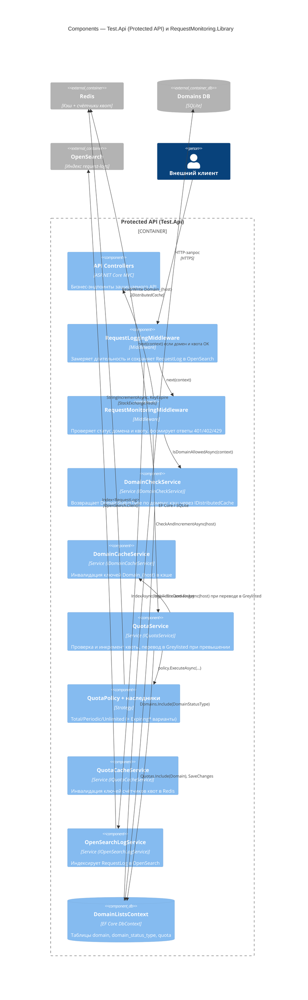

# C4 · Уровень 3 — Components: Protected API + RequestMonitoring.Library

Диаграмма раскрывает внутреннее устройство контейнера **Protected API
(Test.Api)** вместе с компонентами библиотеки `RequestMonitoring.Library`,
которые регистрируются в его DI-контейнере.

## Пояснения

- **Пайплайн middleware** в `Test.Api/Program.cs`:
  `RequestLoggingMiddleware` → `RequestMonitoringMiddleware` → контроллеры.
- **`RequestMonitoringMiddleware`** ветвится по `DomainStatusType.Id`:
  `1` Whitelisted (с проверкой квоты), `2` Greylisted → `402`, `3` Unknown → `401`.
- **Квоты** реализованы стратегией `QuotaPolicy.Create(quota.Type)`. Атомарность
  обеспечивается `StringIncrementAsync` Redis, в SQLite счётчики
  синхронизируются раз в `QuotaSettings:SyncEveryNRequests` запросов.
- **Логирование** в OpenSearch выполняется как fire-and-forget
  (`_ = openSearchLogService.IndexAsync(log)`), чтобы не задерживать ответ.
- **Кэширование статуса домена**: ключ `Domain_{host}` со временем жизни
  `CacheSettings:ExpirationMinutes` (по умолчанию 10 мин).
