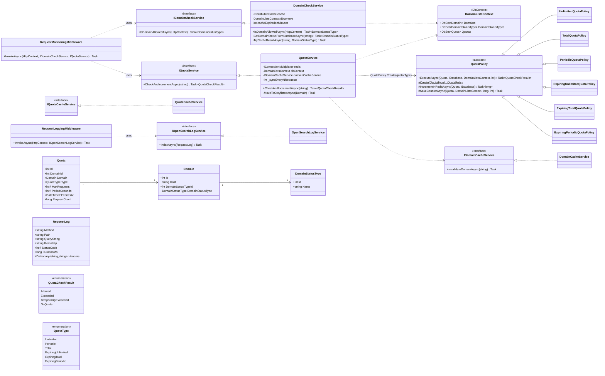

# C4 · Уровень 4 — Code: ключевые классы

Диаграмма классов раскрывает основные типы из `RequestMonitoring.Library`,
участвующие в проверке домена, квот и логировании. Не все поля и методы
показаны — только наиболее важные для понимания архитектуры.

## Заметки

- Все сервисы регистрируются в DI как `Scoped` (см. `Test.Api/Program.cs` и
  `AdminApi/Program.cs`).
- `QuotaService` использует **`IConnectionMultiplexer`** напрямую (а не
  `IDistributedCache`), потому что нужен атомарный `StringIncrementAsync` —
  это важная архитектурная деталь.
- `DomainListsContext` сконфигурирован с `[SetsRequiredMembers]` на
  конструкторе — это необходимо, чтобы корректно создавать его в юнит-тестах
  с `Microsoft.EntityFrameworkCore.InMemory`.
- DTO в `RequestMonitoring.AdminApi/DTO` следуют соглашению ABP:
  `*Dto` для чтения, `*CreateUpdateDto` для команд.
