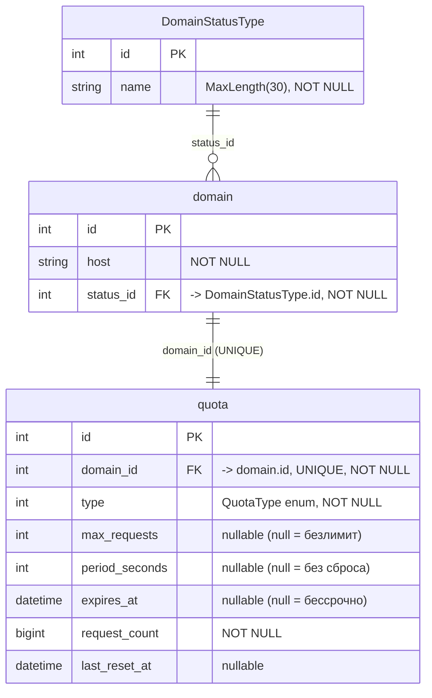

# ER-диаграмма базы данных

Диаграмма отражает реляционную модель данных, описанную в
[`DomainListsContext`](../RequestMonitoring.Library/Context/DomainListsContext.cs)
и сущностях из [`RequestMonitoring.Library/Enitites`](../RequestMonitoring.Library/Enitites).

В реляционной БД хранятся три сущности:

- **`domain`** — домены, мониторинг которых ведётся.
- **`DomainStatusType`** — справочник статусов домена (`Allowed`, `Greylisted`, `Unauthorized`).
- **`quota`** — настройки и текущее состояние квоты для домена (связь 1:1 с `domain`,
  обеспечивается уникальным индексом по `quota.domain_id`).

> Сущность `RequestLog` не входит в `DbContext` и не отображается в реляционной БД,
> поэтому на диаграмме отсутствует.

## Связи

| Связь                         | Кардинальность | Описание                                                                                        |
|-------------------------------|----------------|-------------------------------------------------------------------------------------------------|
| `DomainStatusType` → `domain` | 1 : N          | У каждого домена ровно один статус; один статус может быть присвоен многим доменам.             |
| `domain` → `quota`            | 1 : 1          | У каждого домена не более одной квоты (уникальный индекс по `quota.domain_id`).                 |

## Значения справочника `DomainStatusType` (seed-данные)

| id | name         |
|----|--------------|
| 1  | Allowed      |
| 2  | Greylisted   |
| 3  | Unauthorized |

## Значения перечисления `QuotaType` (хранится в `quota.type`)

| Значение            | Описание                                                |
|---------------------|---------------------------------------------------------|
| `Unlimited`         | Без ограничений                                         |
| `Periodic`          | Лимит запросов с периодическим сбросом счётчика         |
| `Total`             | Суммарный лимит запросов без сброса                     |
| `ExpiringUnlimited` | Без ограничений до даты `expires_at`                    |
| `ExpiringTotal`     | Суммарный лимит, действует до `expires_at`              |
| `ExpiringPeriodic`  | Периодический лимит, действует до `expires_at`          |
